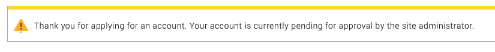
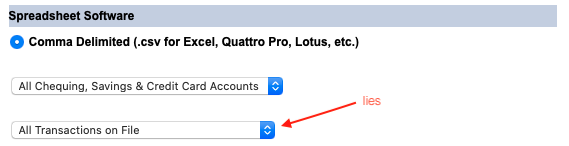
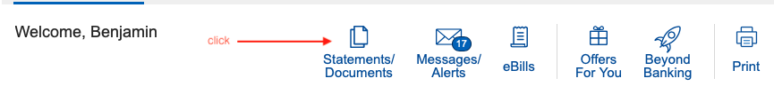
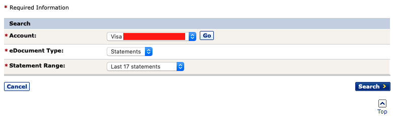

# Teller

### Background

I thought it would be cool to be able to run SQL queries on my banking data. [RBC supposedly has an API](https://developer.rbc.com/home), 
but I tried signing up months ago and never got an account:



The next best thing seemed to be downloading my transaction history in .csv format from RBC online banking, but the data only goes back a couple months.



I wanted to be able to run queries on all transactions since I set up the account (how much money have I spent on sushi?) so that was no good.

This tool was my last resort: parse PDF e-statements. It works for savings, chequing, and visa
accounts. The chequing/savings statements are the same format and the visa ones are different. I expect the chequing/savings parser to work for everyone,
but I'm not sure if different visa types will work because the statements might be formatted differently.
If you want to create a PR to support a different style of account/statement that'd be cool.

 **Disclaimer**: The data that this tool spits out might not be accurate.
 
The parsers check the transactions they find against the opening/closing balances reported on the e-statements and will fail out if they notice a discrepancy,
so the data is *probably* good if nothing fails when you run the tool.

An idea for an extension of this project would be to automate downloading/importing the .csv reports from RBC online every X days. Parsing transaction data from the .csvs would be much more robust and might as well replace pdf parsing once you have your historical data.

### How to use

- Clone this repo

```
git clone git@github.com:bnwlkr/Teller.git
cd Teller
```

- (optional, recommended) Use a virtualenv

```
python3 -m venv venv
source venv/bin/activate
```

- Install dependencies
```
(venv) pip install -r requirements.txt
```

- Download all your e-statements (v boring)





- Put the downloaded pdfs into the `statements/savings`, `statements/chequing`, `statements/visa` directories.
  
*Note*: You can put the statements anywhere on your computer as long as the statements' parent directories are called `chequing`, `savings`, `visa`.
Future improvement: detect account type. Directory structure looks like this:

```
statements
├── chequing
│   └── XXXXXXXXX-2020May25-2020Jun25.pdf
|   ...
├── savings
│   └── XXXXXXXXX-2020May25-2020Jun25.pdf
|   ...
└── visa
    └── XXXXXXXXX-2020May12-2020Jun10.pdf
    ...
```

The tool uses tha names of the files to ascertain some date info so pls don't change them.

- Run it!

```
(venv) python teller.py -d statements teller.db
```

If you put the statements somewhere else, specify the path to their parent directory with the `-d` option. 

After a while, `teller.db`, a [sqlite3](https://www.sqlite.org/index.html) database file, will contain all the transaction data. You can just leave the data there, and later add new statements and rerun with the same .db file - the tool will manage uniqueness of transactions in the database (duplicate files are fine). I recommend rerunning later with only new statements to save time - the tool only inserts to the .db file.

You can use the sqlite3 CLI to run queries, but I recommend using [DB Browser for SQLite](https://sqlitebrowser.org).

Now you can have fun running queries and feeling bad about your spending habits. For example:

```
SELECT sum(amount) FROM transactions WHERE description like '%Dunbar Sushi%'
```

P.S. If you know a way to get all RBC transaction data in a computer-readable format instead of this nonsense, just don't tell me.


